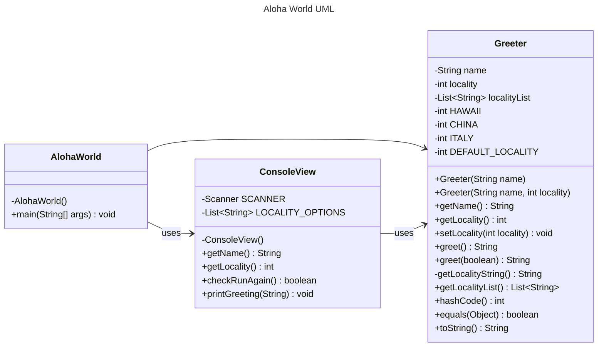

# Homework Aloha World Report

The following report contains questions you need to answer as part of your submission for the homework assignment. 

## Design Doc
Please link your UML design file here. See resources in the assignment on how to
link an image in markdown. You may also use [mermaid] class diagrams if you prefer, if so, include the mermaid code here.  You DO NOT have to include Greeting.java as part of the diagram, just the AlohaWorld application that includes: [AlohaWorld.java], [Greeter.java], and [ConsoleView.java].

### Program Flow
Write a short paragraph detailing the flow of the program in your own words. This is to help you understand / trace the code (and give you practice of something called a code walk that will be required in this course).

> The program start at main method from class AlohaWorld. Class ConsoleView responsible for obtain name, local info, and dealing check the user input is valid or not.
> After gaining info from user, class Greeter generates a corresponding greeting based on the user's region. Finally. the program will ask the user does he needs to change the region and greet again.

## Assignment Questions

1. List three additional java syntax items you didn't know when reading the code.  (make sure to use * for the list items, see example below, the backtick marks are used to write code inline with markdown)
   
   * `switch`
   * `override`
   * `static`

2. For each syntax additional item listed above, explain what it does in your own words and then link a resource where you figured out what it does in the references section. 

    * The `switch` statement is a multi-way branch statement. It means Java switch statement executes one statement from multiple conditions.[^1] The switch statement can be labeled with multi cases or default labels. The switch statement evaluates its expression, then executes all statements that follow the matching case label.[^2]
    * `Override` in Java occurs when a subclass implements a method which is already defined in the superclass or Base Class. It allows a subclass to provide its specific implementation for a method inherited from its parent class. The actual method executed is determined by the object’s runtime type, not just the reference variable’s type.[^3]
    * The `static` keyword is a non-access modifier used for methods and attributes. `Static` methods/attributes can be accessed without creating an object of a class.[^4] The users can apply `static` keywords with variables, methods, blocks, and nested classes. The `static` keyword belongs to the class rather than an instance of the class. The `static` keyword is used to share the same variable or method of a given class. [^5]

3. What does `main` do in Java? 

   `main()` method is the starting point that execute a Java program. Java will not execute the code, if the program is missing the main method. Additionally, the structure of main method needs to be in a specific format, so that the JVM can recognize that the main method as its entry point. If the method's signature is not the same, the program will fail to execute.

4. What does `toString()` do in Java? Why should any object class you create have a `toString()` method?

   The `toString()` method is inherited from the Object class and is primarily used to convert an object into a human-readable string representation. By overriding this method, we can customize the string representation of an object, making it not only convenient for debugging and logging but also providing meaningful information when the object is printed directly.

5. What is javadoc style commenting? What is it used for? 

   Javadoc style comments are a comment format, marked with `/** */`, which can automatically generate documentation for a program. These comments include descriptions of classes, methods, parameters. Furthermore, there are special tags such as `@param` (parameter description), `@return` (return value description), and `@throws` (exception description).

6. Describe Test Driving Development (TDD) in your own words. 

   Test-Driven Development is a methodology that test cases are written before coding. We can make the code more efficient through defined a test class first, ensuring the correctness of the code functionality before implementing the specific functionality in the `main` class.

7. Go to the [Markdown Playground](MarkdownPlayground.md) and add at least 3 different markdown elements you learned about by reading the markdown resources listed in the document. Additionally you need to add a mermaid class diagram (of your choice does not have to follow the assignment. However, if you did use mermaid for the assignment, you can just copy that there). Add the elements into the markdown file, so that the formatting changes are reserved to that file. 

## Deeper Thinking Questions

These questions require deeper thinking of the topic. We don't expect 100% correct answers, but we encourage you to think deeply and come up with a reasonable answer. 

1. Why would we want to keep interaction with the client contained to ConsoleView?
   
   We can centralize the class function by integrate the functions that interact with users. If the input/output functions need to be modified, it is easy to maintain because we separated different functions into classes. It also makes the code cleaner by isolating the input function.

2. Right now, the application isn't very dynamic in that it can be difficult to add new languages and greetings without modifying the code every time. Just thinking programmatically,  how could you make the application more dynamic? You are free to reference Geeting.java and how that could be used in your design.
   
   We can create a file to store various greeting data such as JSON, so it can be easily accessed and modified. After that we can establish a method to read data from file, and then change method which generate the context. Lastly, we can add new greeting into the file without changing code.  

> [!IMPORTANT]
>  After you upload the files to your github (ideally you have been committing throughout this progress / after you answer every question) - make sure to look at your completed assignment on github/in the browser! You can make sure images are showing up/formatting is correct, etc. The TAs will actually look at your assignment on github, so it is important that it is formatted correctly.

## References

[^1]: Switch Statements in Java: 2024. https://www.geeksforgeeks.org/switch-statement-in-java/. Accessed: 2025-01-25. 

[^2]: The switch Statement. https://docs.oracle.com/javase/tutorial/java/nutsandbolts/switch.html. Accessed: 2025-01-25.

[^3]: Overriding in Java: 2025. https://www.geeksforgeeks.org/overriding-in-java/. Accessed: 2025-01-25.

[^4]: Java static keyword. https://www.w3schools.com/java/ref_keyword_static.asp. Accessed: 2025-01-25.

[^5]: static Keyword in Java: 2025. https://www.geeksforgeeks.org/static-keyword-java/. Accessed: 2025-01-25.

[^6]: Overriding in Java: 2025. https://www.geeksforgeeks.org/overriding-in-java/. Accessed: 2025-01-25.

<!-- This is a comment, below this link the links in the document are placed here to make ti easier to read. This is an optional style for markdown, and often as a student you will include the links inline. for example [mermaid](https://mermaid.js.org/intro/syntax-reference.html) -->
[mermaid]: https://mermaid.js.org/intro/syntax-reference.html
[AlohaWorld.java]: src/main/java/student/AlohaWorld.java
[Greeter.java]: src/main/java/student/Greeter.java
[ConsoleView.java]: src/main/java/student/ConsoleView.java